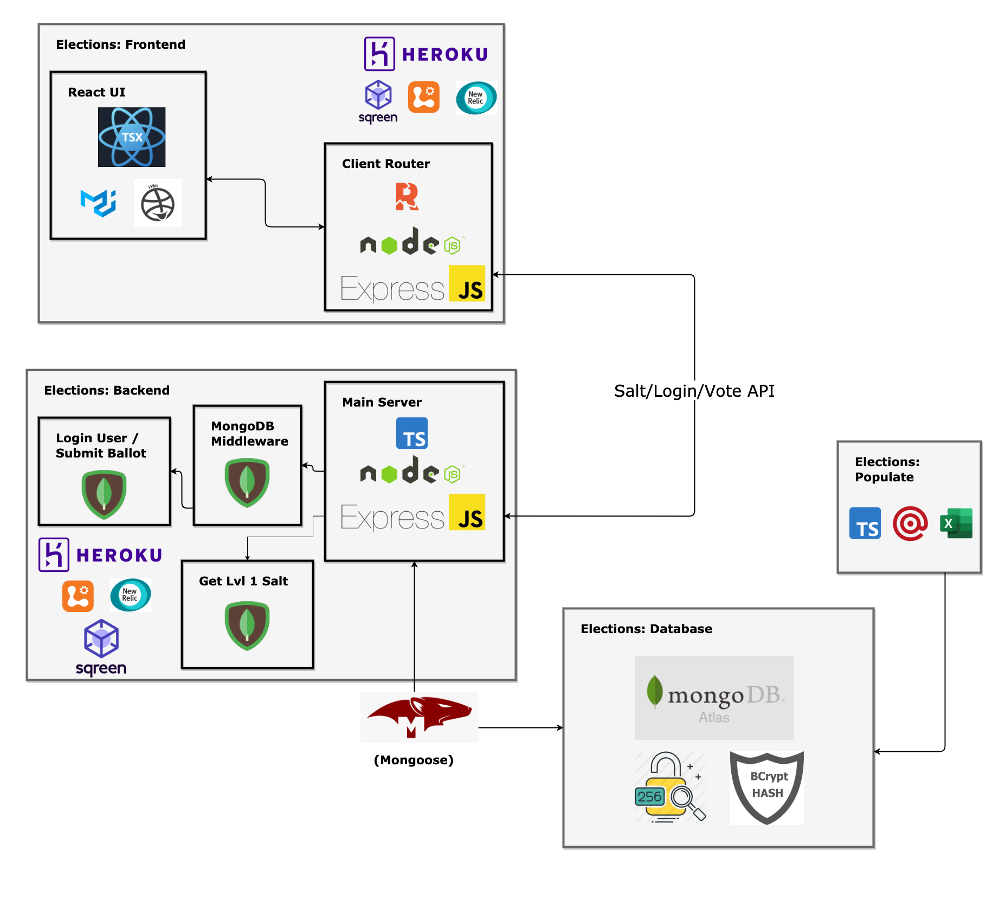
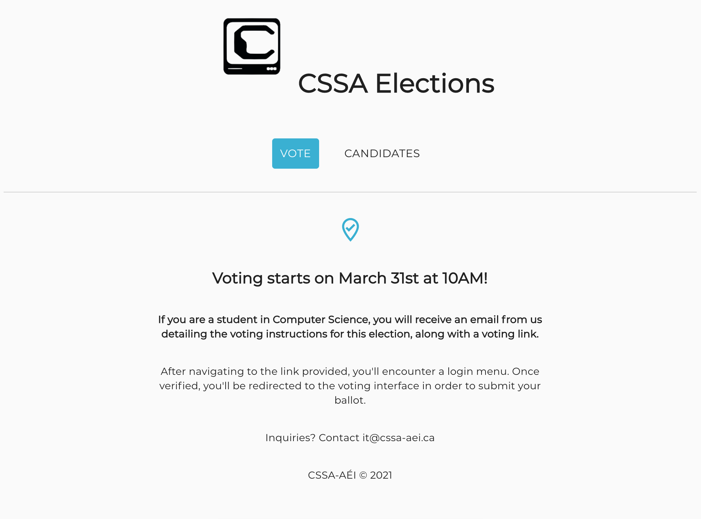
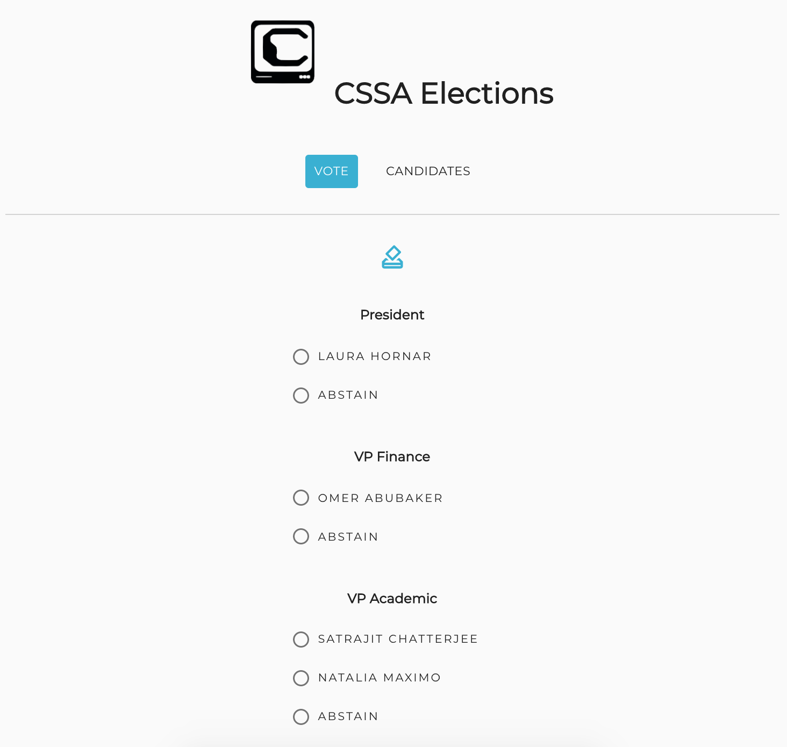
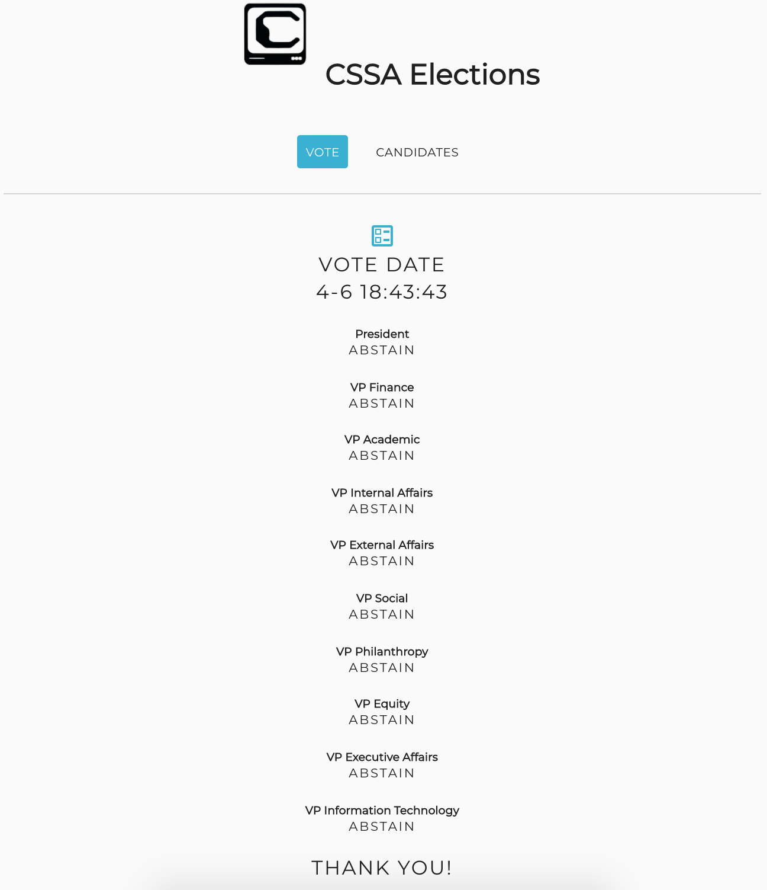

<a title="Realtime application protection" href="https://www.sqreen.com/?utm_source=badge"></a>

# CSSA-AÉI Elections

From March 31st to April 3rd 2021, the Computer Science Student Association (CSSA) hosted its executive elections for the second time online. This year, we decided to build our own bilingual voting platform, as opposed to outsourcing this service to ElectionRunner again. Since every student association has access to an official Mailing List detailing the information of their student body, we were confident that we could establish a legitimate voting platform where only CSSA members can vote.

As a result of being the VP IT for the current academic year, I took the responsibility to design, implement, maintain & monitor the official elections platform for the CSSA 21-22 elections.

## Architecture Details

- Split into two repositories: [`elections-backend`](https://github.com/CSSA-AEI/elections-backend) & [`elections-frontend`](https://github.com/CSSA-AEI/elections-frontend)
- Hosted through two Heroku Pipelines
- Built using a 3-tier MERN Stack
  - MongoDB Atlas
  - Express JS
  - React TSX
  - Node JS
- Written in `Typescript`
- Monitored with [Logentries](https://docs.logentries.com/docs/get-set-up) &[ New Relic APM](https://docs.newrelic.com/docs/apm/#:~:text=With%20New%20Relic's%20Application%20Performance,(non%2Dweb%20apps).)
- Secured with [Sqreen](https://docs.sqreen.com/)
- Bilingualized with `i18n`

## Typical User Flow of the Elections Platform

* The night before the elections:
  - All +1000 CSSA Students receive an email providing their unique voting link, along with voting instructions. For example:

```
The CSSA Elections open March 31st at 10AM!

If you would like to participate in the election (starting 10AM on March 31st), your unique voting link is:

https://vote.cssa-aei.ca/vote/24b1f9bcbed1733e7aadf9fe4e0435e993ea2c0822ab91f45dd891603c4905b6

The deadline to vote is April 3rd at 10AM

Questions or issues? Your point of contact is it@cssa-aei.ca

Thank you for voting!
- Your CSSA exec team
```

* (Users) During the voting period: 
  - Users navigate to their voting link provided, verify their identity, fill out the voting form, and submit their ballot. The time it takes to complete all of this is about 30 seconds.
  - For the rest of the voting period, users who have already voted can review their submitted ballot, along with their time of vote.

* (Sys Admin) During the voting period:
  - Monitor events, memory usage, response times, throughput, apdex scores, and other metrics using Heroku, Logentries, New Relic and Sqreen
  - If needed, unblock IPs that have been blacklisted by Sqreen due to high API call rates (20 in under a minute)

* After the voting period:
  - The Elections Officer (along with the System Administrator) review the Database entries and query the results
  - The Elections Officer announces the results to the current CSSA Executives and external candidates
  - The CSSA Executives release the election results to the CSSA student body

## Images



|                                                      |                                                    |                                                      |
| :---------------------------------------------------: | :------------------------------------------------: | :--------------------------------------------------: |
|  |  |  |
